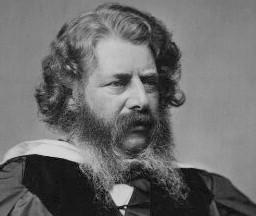

# The Accelerator Wall
## A CMOS-Driven Analysis of Domain-Specific Accelerators

## Background

The slowdown and nearing-end of CMOS scaling are among the major drivers of the computer architecture world towards domain-specific "accelerator" chips. In contrast to general-purpose processors, accelerators are optimized to handle a specific application domain, while delivering higher performance and energy efficiency rates under a limited CMOS chip budget. However, like general-purpose processors, accelerators are still CMOS-based chips implemented using CMOS transistors. Since Moore's law is ending, we know that improving CMOS-driven gains will soon become impossible, and therefore we must explore the trends of gains obtained under the given silicon budget (i.e., the specialization-driven gains).

We present a methodology to decouple the specialization-driven gains of accelerator chips from their physically-driven gains, using a physical chip modeling tool.
We define the "chip specialization returns" (CSR) metric as the ratio between a chip's reported gain (e.g., application throughput) and the gain from its physical capabilities. The CSR metric quantifies the specialization quality of a chip as the average gain per physical (i.e., CMOS) potential.

## RANKINE: A CMOS Potential Modeling Tool for Fast Exploration of Physical Chip Capabilities 

<b> William Rankine. Original photo from Wikipedia (Copyrights: Thomas Annan).</b>

 
In order to quantify chip specialization, we built Rankine, a modeling tool for the physical potential of CMOS-based chips. Rankine computes gain and cost potential functions (e.g., chip throughput, chip throughput per power, chip energy-delay product, etc.) that are derived from the chip's physical characteristics such as transistor count and CMOS node. Much like other potential functions, the absolute computed factors are meaningless, but they are useful when comparing multiple chips. Given a group of chips, we can normalize their reported gains or costs (e.g., throughput) with the physical potential factors that correspond to the explored function. By doing that, we decouple the gain obtained via better-grade silicon (e.g., higher transistor count, faster CMOS technology, etc.) from the gain obtain via specialization, i.e., the gain of the chip compared to its CMOS potential.

Rankine is named after Scottish physicist William John Macquorn Rankine who was the first to suggest the term: "potential energy." Rankine accounts for device scaling, transistor count, and power limitations (e.g., "dark silicon"). We constructed Rankine based on a combination of device-level scaling data using recent CMOS studies and projections, and chip-level scaling data extracted from thousands of commercial datasheets (see our HPCA '19 paper and tool for more details).

Usage:

      rankine.py [options]

Options:

      -n <node>, --cmos-node-nm=<node>
			    CMOS Techology Node [nm]
      -c <count>, --transistor-count=<count>
			    Chip transistor count [millions] (mandatory if die
			    area is not provided)
      -a <area>, --die-area=<area>
			    Chip die area[mm^2] (mandatory if transistor count is
			    not provided)
      -t <power>, --thermal-design-power=<power>
			    Chip thermal design power (TDP)[W]
      -f <freq>, --chip-frequency=<freq>
			    Chip frequency [MHz]

Example: the potentials of a 40 mm2 45nm CMOS chip clocked at 1000MHz: 

      python rankine.py -a 40 -n 45 -f 1000 -t 300

      **************************************************************************
		    RANKINE v0.1: A CMOS Potential Modeling Tool
      **************************************************************************
				      REPORT
      **************************************************************************
      40.0mm^2 45nm chip with 159.97 Million transistors clocked at: 1000.0MHz.
      The thermal design power is: 300.0W.
      **************************************************************************
				  Potential Factors
      **************************************************************************
      Throughput: 1.59973732344e+11
      Throughput per Power: 160256487.303
      Throughput per Area: 3999343308.59
      Throughput per Power per Area: 4006412.18257
      Throughput per Cost: 515.463917526
      Energy: 6.239997e-09
      EDP: 3.90063850395e-20
      ED^2P: 2.43829936753e-31

## ACCELERATOR ZOO: A Collection of Academic and Commercial Domain-Specific Accelerators for Hardware-Specialized Applications       

")      

 <b>Area-efficiency (throughput per Area) of Bitcoin mining ASICs. Relative CMOS potential improvement was 307.4x. Specialization improvement rate was only 1.7x (Source: "The Accelerator Wall: Limits of Chip Specialization", HPCA 2019).</b> 

      
We have created an online data collection of domain-specific accelerator chips for popular accelerated applications. For each application, we store the reported accelerator chip gains, their physical chip characteristics, and the computed CMOS potential factors that were used in our analysis.

Currently, the accelerator zoo contains deep learning using FPGAs, video decoding using ASIC chips, and Bitcoin mining using ASIC chips.

We encourage researchers to contribute data of other accelerator applications and believe that with more data we can achieve a better understanding of existing and future specialization efforts.

## Acknowledgments

This material is based on research sponsored by the NSF under Grants No. 
CNS-1823222 and CCF-1453112, Air Force Research Laboratory (AFRL) and Defense Advanced Research Projects Agency (DARPA) under agreement No. 
FA8650-18-2-7846, FA8650-18-2-7852, and FA8650-18-2-7862. The U.S. Government is authorized to reproduce and distribute reprints for Governmental purposes notwithstanding any copyright notation thereon. The views and conclusions contained herein are those of the authors and should not be interpreted as necessarily representing the official policies or endorsements, either expressed or implied, of Air Force Research Laboratory (AFRL) and Defense Advanced Research Projects Agency (DARPA), the NSF, or the U.S. Government.

## References

If you found our gathered data, analysis, or tools useful for your research, please cite:

    @INPROCEEDINGS{fuchsHPCA19wall, 
      author={Adi Fuchs and David Wentzlaff}, 
      booktitle={Proceedings of the 2019 IEEE International Symposium on High Performance Computer Architecture (HPCA)}, 
      title={The Accelerator Wall: Limits of Chip Specialization}, 
      month = {February},
      year={2019},
      
    }
  
## Caveats

1. Rankine does not account for variance in interconnection overheads (e.g., NoCs, off-chip pinouts etc.). Since it was modeled using real commercial chips, it models the average interconnection overhead of the chips we used.
2. The accelerator applications analyzed in the paper are all in the digital domain. While we believe there might be similar trends for analog domains as well, Rankine does not model analog components (e.g., ADCs.)

Adi Fuchs, 

Princeton University

Contact: (my first name)f@princeton.edu

